# QtPwComponent

An extended material theme component created on top of the Qt default component.

The objective of sharing this component is to encourage the use of this underdog Qt framework, as a fun and easy to build yet still presentable android applications.

This project may reference to many places which I may not gave correct credit to. Do sent me a message so that I can reference it, accordingly.

For that, thanks for giving this library a look at this.

Features:
- Hot-loading functionality via NodeJS (watch and websocket function)
- Dark / Light theme toggle support
- All the extra components use for building a decent looking android apps.
  + Badge
  + ComboBox
  + Card
  + FloatingActionButton
  + TimePicker
  + DatePicker
  + Popup with Checkbox selection
  + Popup with List selection
  + Camera Controller
  + Pull to refresh ListView
  + JsonPath support
  + QR Scanner
  + and many more...

Latest test was against Qt 5.9.6.

# Hot Loading

To start the hot loading, you'll need to install NodeJS of any version.
`cd example\debug`
`npm start`

# Test Application

Open the `example\TestApplication\TestApplication.pro`.

## Theme

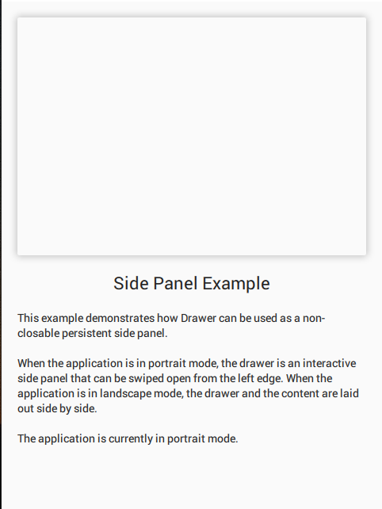 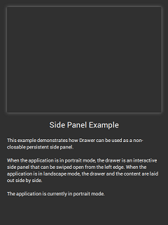

```
Page {
    id: page
    Material.theme: Material.Light
    Material.primary: Material.Blue
    Material.accent: Material.Blue
}
```

### Badge

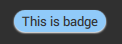 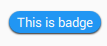

```
AppComponent.Badge {
    text: "This is badge"
}
```

### Card

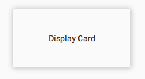 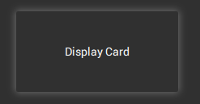

```
AppComponent.Card {
    width: 200
    height: 100
    Label {
        anchors.centerIn: parent
        text: "Display Card"
    }
}
```

### Chip

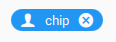 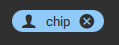

```
AppComponent.Chip {
    iconText: "person"
    text: "chip"
    actionText: "android-cancel"
}
```

### ComboBox

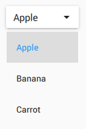 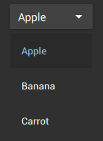

```
AppComponent.ComboBox {
    model: ["Apple", "Banana", "Carrot"]
}
```

### DatePicker

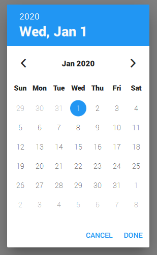 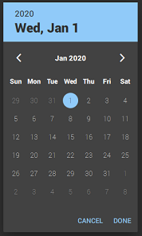

```
AppComponent.DatePicker {
    selectedDate: new Date("2020-01-01")
    Component.onCompleted: open()
}
```

### TimePicker

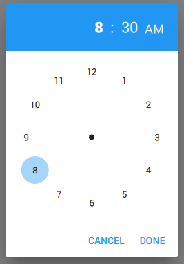 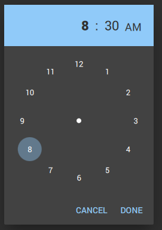

```
AppComponent.TimePicker {
    selectedTime: new Date("2020-01-01 08:30:00")
    Component.onCompleted: open()
}
```

### FloatingActionButton

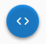 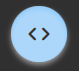

```
AppComponent.FloatingActionButton {
    ionicon: "code"
}
```

### FloatingExtraButton

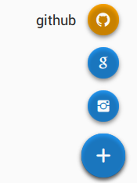 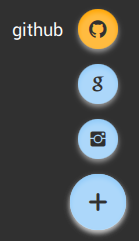

```
AppComponent.FloatingExtraButton {
    model: ListModel {
        ListElement {
            ionicon: "social-github"
            name: "github"
            color: "orange"
        }
        ListElement {
            ionicon: "social-google"
        }
        ListElement {
            ionicon: "social-instagram"
        }
    }
}
```

### IconButton

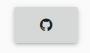

```
AppComponent.IconButton {
    anchors.centerIn: parent
    source: "social-github"
}
```

### ListViewEx

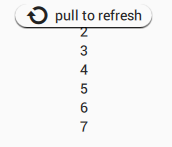

```
AppComponent.ListViewEx {
    anchors.centerIn: parent
    model: [1,2,3,4,5,6,7]
    delegate: Label {
        anchors.horizontalCenter: parent.horizontalCenter
        text: modelData
    }
    onRefresh: console.log("Refreshed")
}
```

### MediaIoniconDelegate

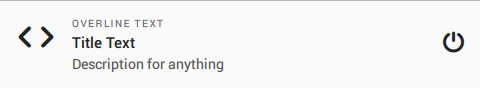

```
AppComponent.ListViewEx {
    anchors.centerIn: parent
    model: [1]
    delegate: AppComponent.MediaIoniconDelegate {
        ioniconText: "code"
        overlineText: "Overline Text"
        //metaStatusText: "Status"
        metaIconText: "power"
        titleText: "Title Text"
        descriptionText: "Description for anything"
    }
}
```

### PopupCheckBox

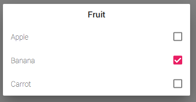 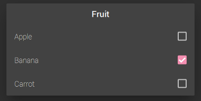

```
AppComponent.PopupCheckBox {
    title: "Fruit"
    model: ["Apple", "Banana", "Carrot"]
    selected: ["Banana"]
    Component.onCompleted: open()
}
```

### PopupSelection

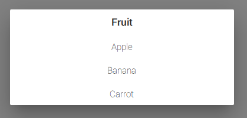 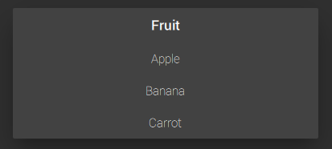

```
AppComponent.PopupSelection {
    title: "Fruit"
    model: ["Apple", "Banana", "Carrot"]
    Component.onCompleted: open()
}
```

### PopupConfirmation

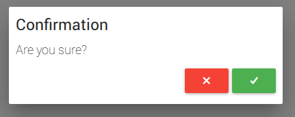 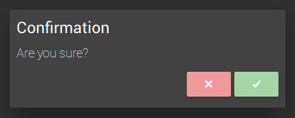

```
AppComponent.PopupConfirmation {
    title.text: "Confirmation"
    desc.text: "Are you sure?"
    onCancel: console.log("cancel")
    onConfirm: console.log("confirm")
    Component.onCompleted: open()
}
```

### QRScannerContainer


```
AppComponent.QRScannerContainer {
    anchors.fill: parent
    onLastTagChanged: console.log(lastTag)
}
```
